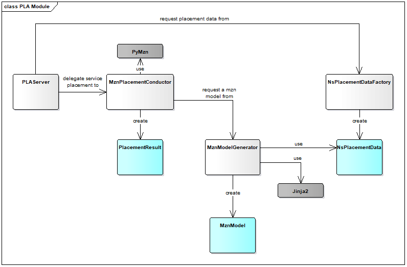

<!--
Copyright 2020 ArctosLabs Scandinavia AB

Licensed under the Apache License, Version 2.0 (the "License");
you may not use this file except in compliance with the License.
You may obtain a copy of the License at

   http://www.apache.org/licenses/LICENSE-2.0

Unless required by applicable law or agreed to in writing, software
distributed under the License is distributed on an "AS IS" BASIS,
WITHOUT WARRANTIES OR CONDITIONS OF ANY KIND, either express or
implied.
See the License for the specific language governing permissions and
limitations under the License
-->

# Placement module (PLA) design description
## Overview
The PLA module provides computation of optimal placement of VNFs over VIMs by matching NS specific requirements to infrastructure availability and run-time metrics, while considering cost of compute/network.

This document supplement the Placement Module (PLA) Users's Guide by providing details on the SW design.

PLA is a separate module in the OSM architecture. As other OSM modules it runs in a Docker container.
PLA interacts with LCM over the Kafka message bus and handles the following message:  
* topic: pla - command: get_placement

When LCM receives a ns instantiation command with config parameter `placement-engine: PLA` it shall request placement computation from PLA. 
See PLA User's Guide for details and capabilities for different types of instantiation commands and necessary configuration of PLA.

The placement computation is done by Minizinc (www.minizinc.org) on a constraints model that is created according to the content of the ns instantiation command.

The minizinc models are created on demand within PLA using the Jinja2 templating language.

## SW components overview
The diagram below illustrates the important classes, data structures and libraries within PLA.



**PLA Server**

This is the PLA server (server.py).
Capability: Produce placement suggestions based on a placement request from LCM OSM module. The get_placement() method extract information based on the referred instantiation operation id and calculates possible deployments for the NS by matching the NS specific requirements to infrastructure, - availability and, -run-time metrics,  while considering cost of compute/network.
Collaborates with: MznPlacementConductor, NsPlacementDataFactory

**MznPlacementConductor**

Capability: Manages minizinc model creation, execution and processing of minizinc output. Use the NsPlacementData provided from the PLA Server and collaborates with MznModelGenerator for model creation and uses PyMzn for execution of the created minizinc model.
Collaborates with: PLA Server, MznModelGenerator

**MznModelGenerator**

Capability: Create instance of MznModel using the information kept in NsPlacementData combined with Jinja2 templating language/templating engine. 
Collaborates with: MznPlacementConductor

**NsPlacementDataFactory**

Capability: Knows how to create a NsPlacementData instance. Receives placement request data and collects additional information on; NSD/VNFD, Infrastructure topology, link delays and possibly more things (e.g. resource utilization, after rel.7).
Collaborates with: PLA Server

**NsPlacementData**

Dictionary keeping relevant data for a placement request so that a corresponding minizinc model can be created. Content includes e.g. vim account information, price lists, network topology, link characteristics and network service characteristics.

**PlacementResult**

Carries processed result of the optimal placement solution as computed by minizinc

**MznModel**

String representation of a mzn model

**PyMzn**

PyMzn is a Python library providing bindings to minizinc.

**Jinja2**

Jinja2 is a template engine used in PLA when creating the minizinc model for a placement request.


## Unit tests
### Unit testing dependencies
Some of the unit test modules have dependencies to Minizinc, e.g. test_mznmodels.py and test_mznPlacementConductor.py.
If these tests are to be performed outside a PLA container context, like .e.g. from CLI or from within an IDE, setup the environment as follows (linux example):
1. install minizinc as a snap from snapcraft.io/minizinc
2. create a softlink from /minizinc/bin/minizinc to /snap/bin/minizinc to mimic the container structure in the development host

```
$ sudo snap install minizinc --classic
$ sudo mkdir -p /minizinc/bin
$ sudo ln -s /snap/bin/minizinc /minizinc/bin/minizinc 
```
