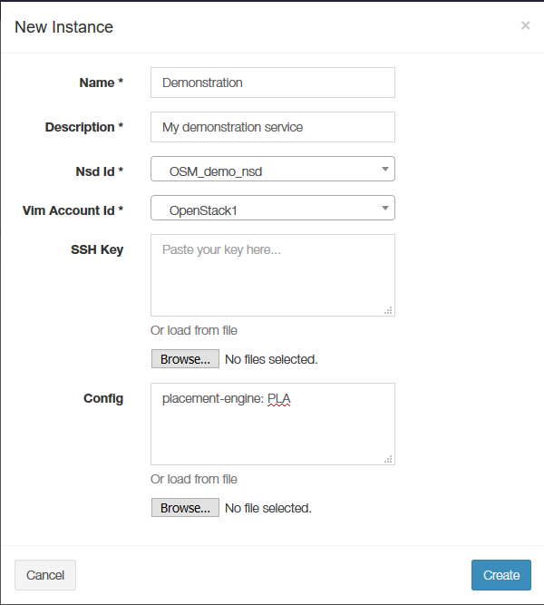

<!--
Copyright 2020 Arctos Labs Scandinavia AB

Licensed under the Apache License, Version 2.0 (the "License");
you may not use this file except in compliance with the License.
You may obtain a copy of the License at

   http://www.apache.org/licenses/LICENSE-2.0

Unless required by applicable law or agreed to in writing, software
distributed under the License is distributed on an "AS IS" BASIS,
WITHOUT WARRANTIES OR CONDITIONS OF ANY KIND, either express or
implied.
See the License for the specific language governing permissions and
limitations under the License
-->

# Placement module (PLA) User's Guide

## Introduction
To use the placement functionality of OSM several steps needs to be taken to configure and enable the function.
1.	OSM needs to be installed with the PLA module included
2.	Create the price lists for compute and transport links
3.	Create the inventory of PoP interconnecting links
4.	Update the PLA container with price list and inventory file
5.	Usage - Instantiate the service using the placement engine

## Install OSM including PLA
PLA is an optional module in OSM. It is installed together with OSM by adding ``--pla`` to the install script.

`$ ./install_osm.sh --pla`

## Create the price lists
The price list for compute determines the price for each VNF at each VIM (or Point of Presence - PoP). 
The file (vnf_price_list.yaml) is written in Yaml. There are two different structures possible for the price list file.
In the first alternative prices for a specific VIM are directly associated with a vnfd. 
In the second alternative prices for a specific VIM are also associated with a OSM project id.
The latter alternative makes it possible for different OMS users to have different price models depending on their 
associated OMS project.

###vnf_price_lists.yaml - Alternative one

```
- vnfd: testVnfOne
  prices:
    - vim_url: http://10.234.12.47:5000/v3
      vim_name: OpenStack1
      price: 10
    - vim_url: http://10.234.12.44:5000/v3
      vim_name: OpenStack2
      price: 9
- vnfd: hackfest_multivdu-vnf
  prices:
    - vim_url: http://10.234.12.47:5000/v3
      vim_name: OpenStack1
      price: 17
    - vim_url: http://10.234.12.44:5000/v3
      vim_name: OpenStack2
      price: 18
```
###vnf_price_list.yaml - Alternative two
```
- vnfd: testVnfOne
    project_alfa:
      prices:
        - vim_url: http://10.234.12.47:5000/v3
          vim_name: OpenStack1
          price: 10
        - vim_url: http://10.234.12.44:5000/v3
          vim_name: OpenStack2
          price: 9
    project_beta:
      prices:
        - vim_url: http://10.234.12.47:5000/v3
          vim_name: OpenStack1
          price: 9
        - vim_url: http://10.234.12.44:5000/v3
          vim_name: OpenStack2
          price: 10
- vnfd: hackfest_multivdu-vnf
    project_alfa:
      prices:
        - vim_url: http://10.234.12.47:5000/v3
          vim_name: OpenStack1
          price: 17
        - vim_url: http://10.234.12.44:5000/v3
          vim_name: OpenStack2
          price: 18
    project_beta:
      prices:
        - vim_url: http://10.234.12.47:5000/v3
          vim_name: OpenStack1
          price: 7
        - vim_url: http://10.234.12.44:5000/v3
          vim_name: OpenStack2
          price: 8
```

The price list for transport links between VIMs (PoP Interconnecting Link – PiL). In current release the price is given per link without any consideration to BW or other QoS parameter. The file (pil_price_list.yaml) is written in Yaml and is exemplified below. Note: In current OSM release the link characteristics are hard coded into this file, in future releases this data should be retrieved from the infrastructure by monitoring mechanisms.

```
pil:
  - pil_description: Link between OpenStack1 and OpenStack2
    pil_price: 12
    pil_latency: 120
    pil_jitter: 12
    pil_endpoints:
      - OpenStack1
      - OpenStack2
  - pil_description: Link between OpenStack1 and OpenStack3
    pil_price: 13
    pil_latency: 130
    pil_jitter: 13
    pil_endpoints:
      - OpenStack1
      - OpenStack3
  - pil_description: Link between OpenStack1 and OpenStack4
    pil_price: 14
    pil_latency: 140
    pil_jitter: 14
    pil_endpoints:
      - OpenStack1
      - OpenStack4
  - pil_description: Link between OpenStack2 and OpenStack3
    pil_price: 23
    pil_latency: 230
    pil_jitter: 23
    pil_endpoints:
      - OpenStack2
      - OpenStack3
  - pil_description: Link between OpenStack2 and OpenStack4
    pil_price: 24
    pil_latency: 240
    pil_jitter: 24
    pil_endpoints:
      - OpenStack2
      - OpenStack4
  - pil_description: Link between OpenStack3 and OpenStack4
    pil_price: 34
    pil_latency: 340
    pil_jitter: 34
    pil_endpoints:
      - OpenStack3
      - OpenStack4

```

## Create the inventory file
The VIMs configured in OSM are assumed to be connected to each other with transport links - PiLs. In current release the inventory file describes the available PiLs with latency and jitter. If there is no PiL in the inventory file for any pair of PoPs the placement engine will not be able to use that relation for a VL.

## Update the PLA container
Copy the price lists and inventory files to the PLA container using the following commands:

`$ docker cp vnf_price_list.yaml $(docker ps -qf name=osm_pla):/placement/.`

`$ docker cp pil_price_list.yaml $(docker ps -qf name=osm_pla):/placement/.`

## Instantiate the service
When creating a NS instance, it is possible to pass instantiation parameters to OSM using the `--config` option of the client or the `config` parameter of the UI. To invoke the placement engine following directives are used.

`
--config '{placement-engine: PLA}'
`

### Usage examples

#### Basic usage
`$ osm ns-create --ns_name ThreeVNFTest --nsd_name three_vnf_constrained_nsd --vim_account OpenStack1 --config '{placement-engine: PLA}'
`

Using PLA support from the GUI network service create form:



### With pinning of member-vnf-index: "3" to vim_account: OpenStack3
To enable automatic placement with one (or multiple) VNFs at a pre-determined place (e.g. near CPE), PLA has the ability do placement with one or multiple VNFs pinned to datacenter(s). The pinning is done in the same way as explained in section [Multi-site deployments](https://osm.etsi.org/wikipub/index.php/OSM_instantiation_parameters#Multi-site_deployments_.28specifying_different_VIM_accounts_for_different_VNFs.29) in the OSM wiki.

Example NS instantiation using CLI command (pinning one of three VNFs in the used NSD):
`$ osm ns-create --ns_name ThreeVnfTest2 --nsd_name three_vnf_constrained_nsd --vim_account OpenStack1 --config '{placement-engine: PLA, vnf: [{member-vnf-index: “3", vim_account: OpenStack3}]}'`


### With constraints as instantiation parameters
It is also possible to provide constraints as instantiation parameters. Such constraints are included in a dictionary belonging to the `constraints` key as follows: 

`config: {placement-engine: PLA, constraints: {<constraints specifications>}}`

#### vld constraints as instantiation parameters
Currently the supported type of constraints is placed on the vlds, and is identified with the `vld-constraints` key in the constraints specifications. Each vld that is given constraints have the form `{id: <id from nsd>, link-constraints: {latency: <max allowed latency>, jitter: <max allowed jitter>}`. It is not necessary to place constraints on all links, it is also possible to freely mix the supported constraint types `latency` and `jitter` as desired.

Example NS instantiation using CLI command with constraints put on `vld_1` and `vld_2`

`$ osm ns-create --ns_name ThreeVnfTest2 --nsd_name three_vnf_constrained_nsd --vim_account OpenStack1 --config '{placement-engine: PLA, vnf: [{member-vnf-index: “3", vim_account: OpenStack3}], constraints: {vld-constraints: [{id:vld_1, link-constraints: {latency: 120, jitter: 20}}, {id:vld_2, link-constraints: {latency: 120, jitter: 20 }}]}}'`
